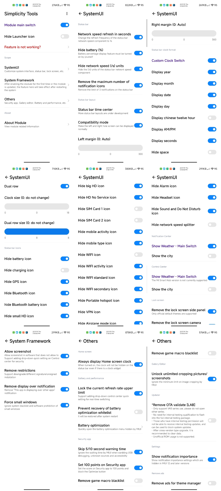

   
   <h1>WooBox For RedmagicOS</h1>
   

       <b>English | <a href="../README.md">Simplified Chinese</a></b>
   

   
   
   
   
An Xposed module for system extension adapted for RedmagicOS 9 (Android 14)

---

### Module Description

Only supports RedmagicOS 9 (Android 14). Other versions are incompatible.

Developer: [@u9521](https://github.com/u9521)

Original Developer: [CoolApk@乌堆小透明](http://www.coolapk.com/u/883441)

---

### Screenshots ~~(Legacy screenshots, to be updated later)~~

---

### Download Links

Repository Release (currently the only distribution channel): [releases](https://github.com/u9521/WooBoxForRedmagicOS/releases)

~~Xposed Repository Download: [Click here for latest release](https://github.com/Xposed-Modules-Repo/wooboxforredmagicos/releases)~~

~~CoolApk Download: [Click here for latest release](https://www.coolapk.com/apk/wooboxforredmagicos)~~

---

### Third-Party Open Source References

##### GNU General Public License v3.0

[qqlittleice/MiuiHome](https://github.com/qqlittleice/MiuiHome)

[yujincheng08/BiliRoaming](https://github.com/yujincheng08/BiliRoaming)

[Mikanoshi/CustoMIUIzer](https://code.highspec.ru/Mikanoshi/CustoMIUIzer)

[LSPosed/DisableFlagSecure](https://github.com/LSPosed/DisableFlagSecure)

##### GNU General Public License v2.0

~~[LSPosed/CorePatch](https://github.com/LSPosed/CorePatch)~~(No longer integrated, click link to download if needed)

##### GNU Lesser General Public License v3.0

[LuckyPray/DexKit](https://github.com/LuckyPray/DexKit)

##### GNU Lesser General Public License v2.1

[577fkj/blockmiui](https://github.com/577fkj/blockmiui)

---

### License

[GNU General Public License v3.0](../LICENSE)
